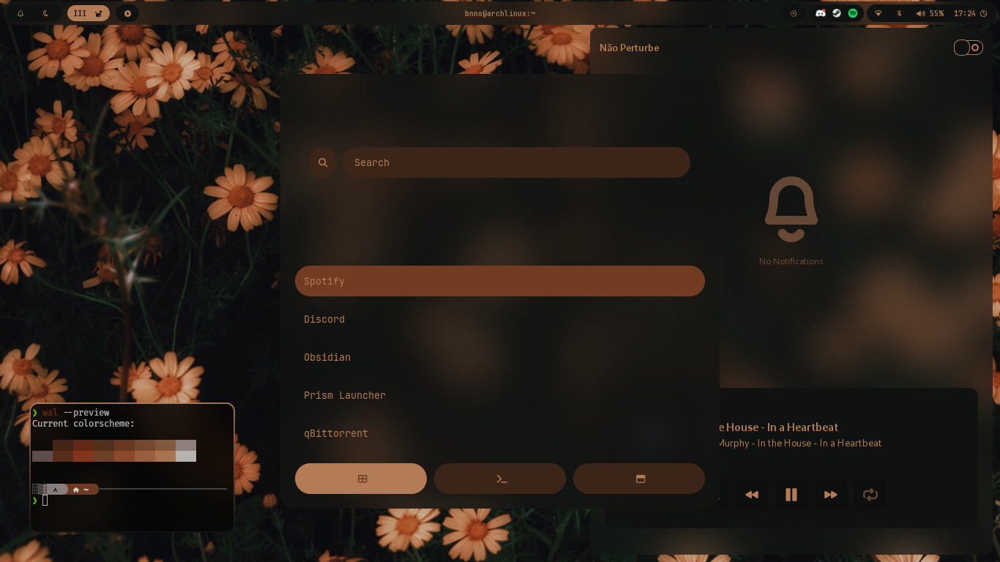
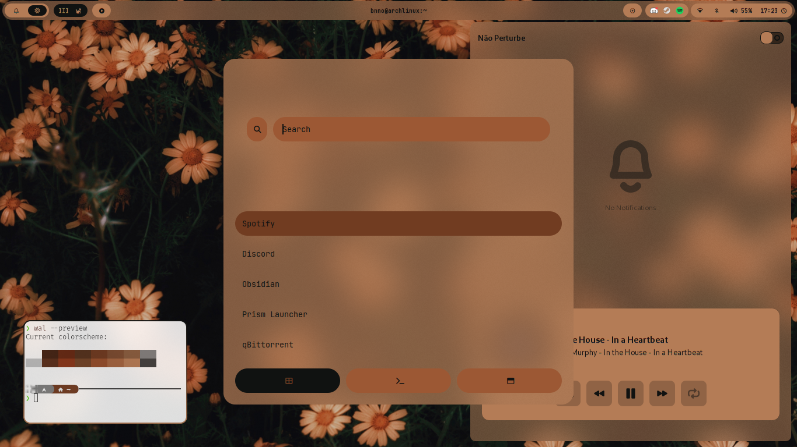
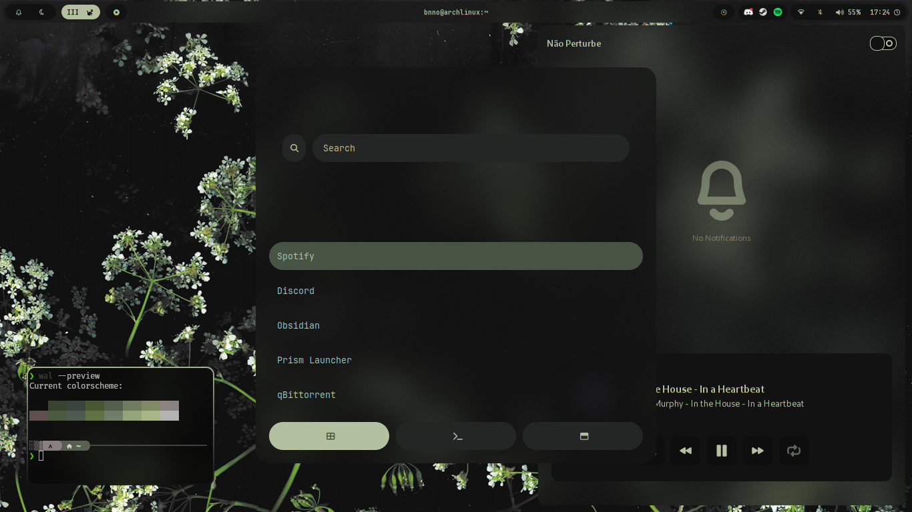
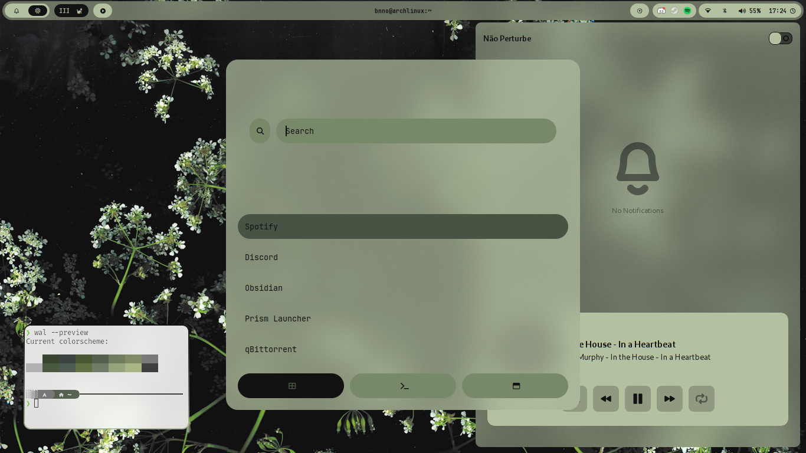

### Description

Project for archlinux using waypaper as a mediator to perform a palette exchange script using the wallpaper used.
Supports all formats used by the waypaper

<https://github.com/user-attachments/assets/c708cfef-df16-41c1-879e-384afe0ace1c>

### What is Chromadots

This project came about as a simple script to change the colors of the waybar, but as I perfected, the project grew in scope. Seeing programs that use CSS to control interface colors

### Programs used

- Hyprland
- Hyprlock
- Hypridle
- Waypaper
- Waybar
- Kitty
- Rofi
- Clipse
- Swaync
- Wlogout

### Examples

#### The Palette example 1

#### Palette example 2

### Installation method

1. **Backup your data and .config folder**
   1. **This step is extremely important due to the nature of the project**
2. Install the necessary programs
   1. Chromadots uses AURs, it is recommended to use an AUR Helper like yay or paru
   2. If you have yay installed use: `yay -S hyprlock hyprlock hypridle waybar waypaper rofi-wayland swaync wlogout python-pywal16 python-haishoku python-configargparse clipse python-colorthief feh swaybg swww mpvpaper`
   3. To add the colors of the palette to your terminal follow the [pywal tutorial](https://github.com/eylles/pywal16/wiki/Getting-Started#applying-the-theme-to-new-terminals)
3. Install a nerd font for the icons in waybar, the one already configured is JetBrain Mono Nerd Font
   1. To install it download the font and place in .local/share/fonts or use `yay -S ttf-jetbrains-mono-nerd`
4. Enable autostart for hypridle, waypaper, swaync and clipse
   1. They are started in .config/hypr/configs/programs.conf, but can also be auto started with `systemctl enable`/`systemctl start`
5. Create a virtual python environment for installing the necessary packages
    1. **It is important to keep the name of files and folders in order not to occur problems in the execution of the script**
    2. Go to the waybar folder, create a folder called scripts
    3. Inside the scripts folder use the command `python -m venv waybar-venv`
    4. Activate the venv with the command `source waybar-venv/bin/activate`
    5. Use `pip install Pylette` to install the package necessary for the operation of the waybar modules and the palette script
6. Acquire Chromadots
    1. Choose from:
    2. `git clone https://github.com/bnno-aln/chromadots`
    3. Click code and download the repo as a ZIP file
    4. Use the script (WIP)
7. Extract/Move content to your .config

### Extras

Chromadots adds optional support to firefox, discord and spotify/spicetify which require separate installation and configuration.

For Firefox pywal theme use pywalfox AUR and browser extension, for installation see guide in [pywalfox github](https://github.com/Frewacom/pywalfox).

For Discord pywal theme follow the installation for [pywal-discord](https://github.com/franekxtb/pywal-discord).

For Spotify/Spicetify is more complicated, the dotfiles uses the text theme in [spicetify themes gihub](https://github.com/spicetify/spicetify-themes) simply because it does not have a alternative coloscheme and is just a css theme without a javascript tied to it, it could work with other themes but I have not tested.
Follow the installation of [spicetify](https://spicetify.app/docs/advanced-usage/installation/), download the text theme in [spicetify themes gihub](https://github.com/spicetify/spicetify-themes) and apply it in spicetify.
